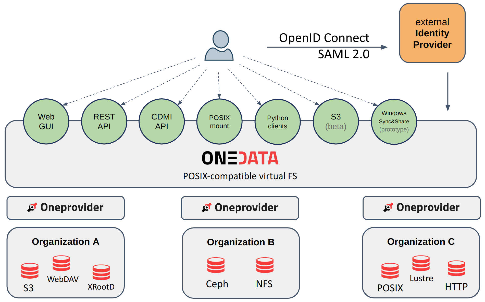
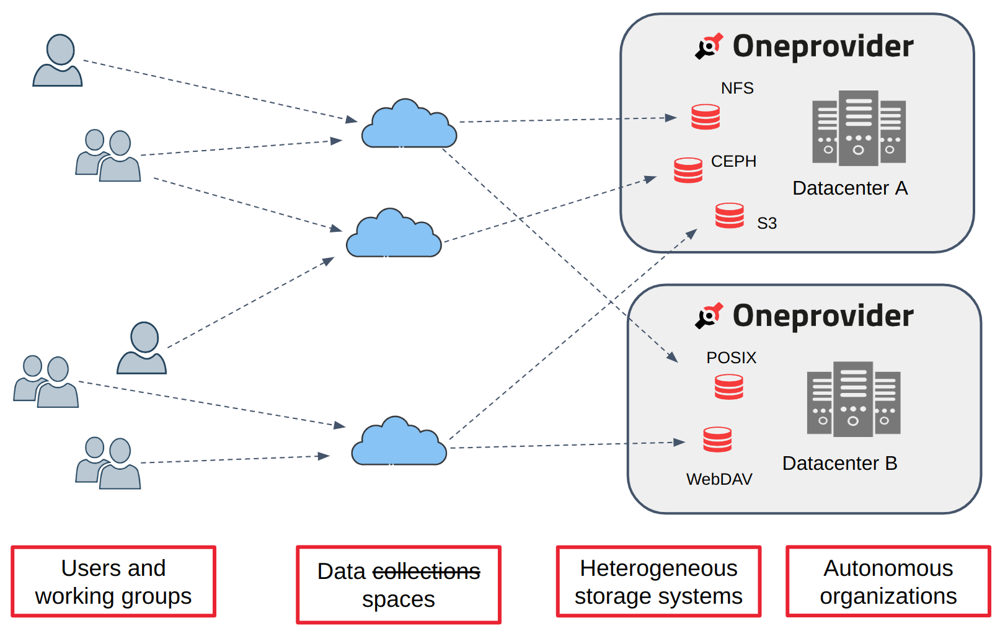

FIXME: how to improve the images so that they display nicely?

> <agenda-title></agenda-title>
>
> 1. TOC
> {:toc}
>
{: .agenda}

# Introduction to Onedata

Onedata ([https://onedata.org](https://onedata.org)) is a data management platform that
provides easy and unified access to globally distributed storage resources, supporting a
wide range of use cases from personal data management to data-intensive scientific
computations. It is an [open-source project](https://github.com/onedata), started in 2013,
and implemented by the team from the Cyfronet Computing Center in Krakow, Poland. 

Onedata creates a virtual file system layer spanning geographically dispersed computing
centers and data providers that host heterogeneous storage resources. The virtual file
system is POSIX-compatible and based on a classic structure of directories and files. The
virtualized data can be access using multiple interfaces: Web GUI, REST API, CDMI API,
fuse-based POSIX mount, Pythonic libraries, or S3. Regardless of the interface, the user
gets the same, unified view of all his data.

Onedata uses the concept of **Spaces** for data organization. A **Space** is a logical
data volume that appears as a monolithic file system from the user’s PoV. Still, it
virtualizes the physical data stored on distributed storage systems of different data
providers. Spaces facilitate collaborative data sharing between users and groups across
organizational domains — using the Onedata interfaces, users can manage and access the
data together in a unified namespace, while it is physically distributed. 

Similarly to the Galaxy project, The Onedata software can be used to build different
ecosystems. Each Onedata ecosystem constitutes an independent data management platform, 
made up of multiple data centers. One of the flagship examples is 
[EGI DataHub](https://datahub.egi.eu), a Europe-wide ecosystem bringing together 17
data sites (as of 03-2025) and catering for many scientific projects around Europe.

For more information about Onedata, see the 
[Documentation](https://onedata.org/#/home/documentation) and 
[API reference](https://onedata.org/#/home/api).

# Onedata & Galaxy integration

Thanks to the efforts undertaken in the
[EuroScienceGateway](https://galaxyproject.org/projects/esg/) project, Galaxy
now offers integration with Onedata. It can be used as 
a **remote source for data import/export** (a.k.a. Files Source Plugin) and as 
a **storage backend for Galaxy datasets** (an Object Store). 
The integration includes **BYOS** (Bring Your Own Storage) and 
**BYOD** (Bring Your Own Data) templates.

Minimal requirements:
- **Galaxy**: version **24.2**
- **Onedata**: version **21.02.4** (but it's recommended to use at least **21.02.8**)

It is possible to connect multiple Onedata accounts in different Onedata
ecosystems to the same Galaxy account.

# Accessing Onedata services

FIXME jak zdobyc domene, jak zdobyc token.

FIXME zlinkowac tutaj tutorial onedata-dev-instance jako ostatnia z opcji.

# Related tutorials

Learn more how to make use of the Galaxy & Onedata integration:

| Audience         | Topic                                                                                                                                            |
| ---------------  | -------------------                                                                                                                              |
| User             | [Importing (uploading) data from Onedata]()                                  |
| User             | [Exporting to Onedata remote]()                                  |
| User             | [Onedata user-owned storage]()                                            |
| Admin            | [Configuring the Onedata integration (remotes, Object Store, BYOS, BYOD)]() |
| Developer        | [Setting up a dev Onedata instance]()                                          |
